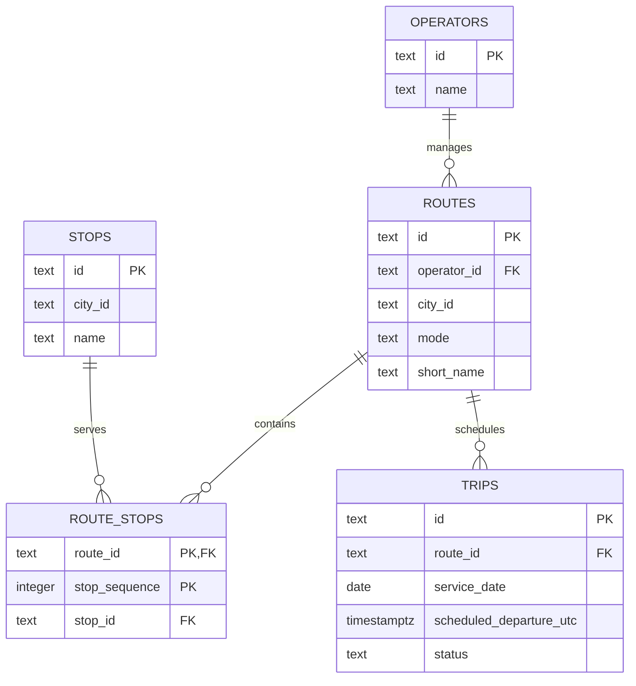

# MobilityTicketing lecture 1 dossier

## System context

The system supports passengers travelling around a city, transport operators managing routes and timetables, and city transport planners who need operational reports. Passengers search for routes and upcoming departures, purchase travel tickets, and present tickets for validation. Operators maintain routes, stops, and scheduled trips. The city transport context includes multiple operators and transport modes sharing stops and serving the same city.

This lecture implements only the route, stop, operator, and scheduled-trip slice. Ticket purchase, ticket validation, real-time availability, and reporting are documented as future access patterns rather than implemented features.

## Access-pattern map

| User or process | Access pattern | Lecture 1 implementation |
| --- | --- | --- |
| Passenger | Search routes between or near stops | Routes, stops, and route-stop ordering support the basic data; search logic is not implemented |
| Passenger | Purchase a ticket for a selected trip | Not implemented |
| Inspector or gate | Validate a presented ticket | Not implemented |
| Operator | Update route stops and route metadata | Tables and relationships support route maintenance |
| Operator | View upcoming trips after a timestamp | Query 1 |
| Passenger | View the ordered stops on a route | Query 2 |
| Operations team | View route trip totals for a service date | Query 3 |
| Operations team | View real-time vehicle or capacity availability | Not implemented |
| Planner | Produce historical or analytical reports | Not implemented |

## Relational model

The implemented cardinalities are one operator to zero or many routes, one route to zero or many route-stop positions, one stop to zero or many route-stop positions, and one route to zero or many trips. Every route belongs to exactly one operator, every route-stop row belongs to exactly one route and one stop, and every trip belongs to exactly one route.

## Route-stop key decision

The primary key is `(route_id, stop_sequence)`. A sequence number identifies a position within a route, and the composite key prevents two stops from occupying the same position on one route. It does not prevent the same stop from occurring at multiple positions, so loop routes remain representable. The current seed data does not use a repeated stop; whether that is desirable can be revisited when route patterns and direction variants are introduced.

## Functional dependency and normalization

In `route_stops`, `(route_id, stop_sequence) -> stop_id`: a route position determines the stop served at that position. Keeping the stop name only in `stops`, where `stop_id -> name`, prevents repeated stop names and update anomalies across every route that serves the stop. The separate relations therefore avoid partial and transitive duplication in this slice.

## Representative results

Using the seeded service date `2026-08-27`:

- Query 1 for `LINE-M2` after `2026-08-27 07:00:00+00` returns `TRIP-M2-20260827-01` at 07:30 UTC and `TRIP-M2-20260827-02` at 08:00 UTC.
- Query 2 for `LINE-M2` returns Nørreport, Kongens Nytorv, and Copenhagen Airport in sequence 1, 2, and 3.
- Query 3 returns 2 scheduled trips for `M2` and 2 scheduled trips for `5C`. The left join also preserves routes with zero matching trips for another service date.

## Model comparison and assumption

The implementation matches the lecture model: operators own routes, routes connect ordered stops through the route-stop relation, and routes have scheduled trips. The main modelling assumption is that a route-stop position is unique within a route and that a stop may be repeated on a route. This may change later if route direction, branches, or named service patterns need to be represented explicitly.

The implementation proves that the route-maintenance and upcoming-trip relational slice can be recreated and seeded consistently, and that the three stated workloads are expressible. It does not prove ticket lifecycle behaviour, real-time availability, reporting requirements, or production performance characteristics.
